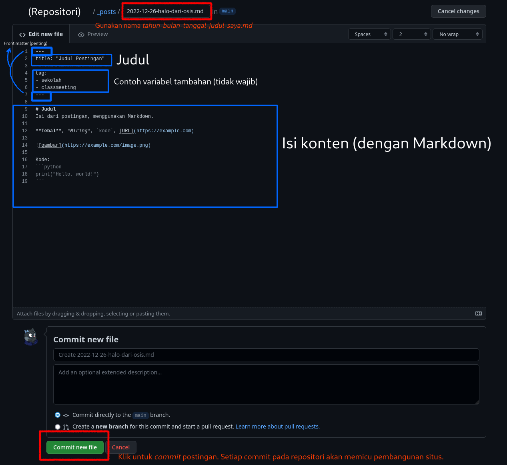

# Situs OSIS PHI

## Awal Mula
Situs blogging OSIS SMPK PENABUR Harapan Indah dikerahkan pada masa bakti 2022-2023.

## Teknis
### Hosting
Situs ini menggunakan [GitHub Pages](https://pages.github.com/) untuk hosting. Kamu sebaiknya [membiasakan diri dengan GitHub](https://docs.github.com/en) dan [git](https://git-scm.com/doc) untuk memelihara website ini.

### Pembangun Situs Web
Situs web ini dibangun menggunakan [Jekyll](https://jekyllrb.com) dengan templat . Untuk mempelajari Jekyll, [buka halaman dokumentasi Jekyll](https://jekyllrb.com/docs/).

### URL dan Domain
Untuk sekarang, situs ini dikerahkan (*deploy*) di `https://daringcuteseal.github.io/osisphi-site` dengan domain (di file [CNAME](/CNAME)) `osisphi.best`. Domain `osisphi.best` dibeli di [Epik](https://registrar.epik.com) dengan biaya $1.99 untuk 1 tahun.

> Mengapa situs ini dikerahkan di situs lain sehingga dapat diakses melalui 2 URL (https://daringcuteseal.github.io/osisphi-site dan https://osisphi.best)?

1. Pendiri website ini awalnya ingin membuat akun GitHub baru khusus untuk meng-host situs ini, namun karena sifat GitHub yang memungkinkan kolaborasi melalui [PR](https://docs.github.com/en/pull-requests/collaborating-with-pull-requests/proposing-changes-to-your-work-with-pull-requests/about-pull-requests) dan [perpindahan pemilik](https://docs.github.com/en/repositories/creating-and-managing-repositories/transferring-a-repository), pembuatan akun baru seharusnya tidak begitu relevan.
2. Pendiri website ini sudah memiliki website `daringcuteseal.github.io`, sehingga tidak memungkinkan untuk membuat repositori khusus untuk website OSIS PHI lagi.
3. *Ya terus kenapa? Bisa dibuka toh. Masalah?*

## Menambahkan Postingan Blog Baru
Letakkan file dengan nama *tahun-bulan-tanggal-judul.md* di folder *_posts* seperti ini:

Contoh postingan:

Seluruh postingan dapat diformat dengan [Markdown](https://docs.github.com/en/get-started/writing-on-github/getting-started-with-writing-and-formatting-on-github/basic-writing-and-formatting-syntax) atau elemen HTML.

## Melakukan Pemindahan Pemilik
Jika program kerja ini akan dilanjutkan pada periode selanjutnya:
1. Minta pemilik repositori ini untuk [mentransfer kepemilikan](https://docs.github.com/en/repositories/creating-and-managing-repositories/transferring-a-repository) repositori kepada kamu.
2. Beli domain yang sesuai. Kamu dapat membeli `osisphi.best` maupun domain lainnya. Ingat untuk mengganti URL situs OSIS PHI pada platform lain seperti [Instagram](https://instagram.com/osis.phi).
3. Ganti konten [CNAME](/CNAME) dengan domain yang telah dibeli. Apabila menggunakan domain yang sama dengan domain periode sebelumnya, kamu tidak perlu menggantinya.
4. [Atur domain custom kamu](https://docs.github.com/en/pages/configuring-a-custom-domain-for-your-github-pages-site/managing-a-custom-domain-for-your-github-pages-site).

